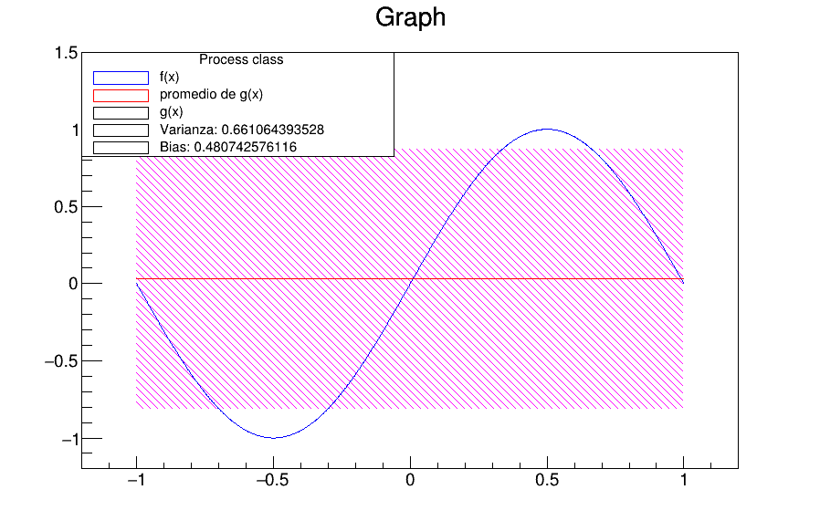
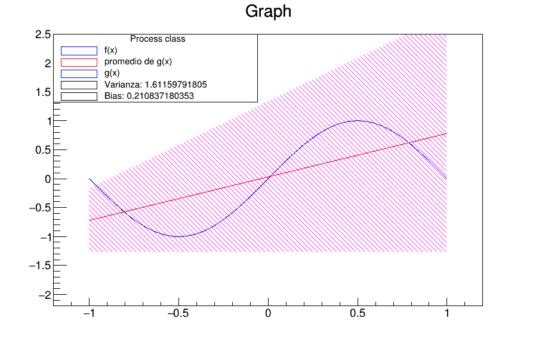

# ML-in-the-function-sin-pi-x-

Basic example to find the best function to optimize sin(pi*x).

Using python and root, CERN's library to generate the plots ( repository to install https://github.com/root-project/root)

H_0 = b

H_1 = ax+b

